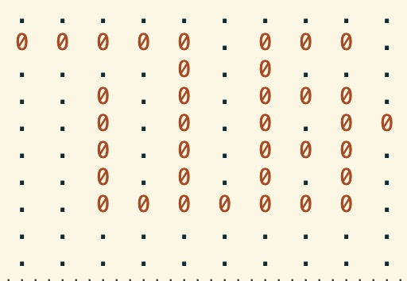
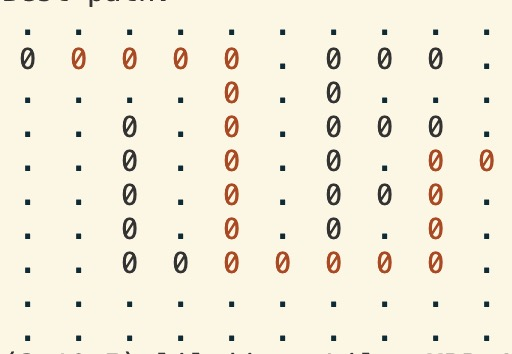
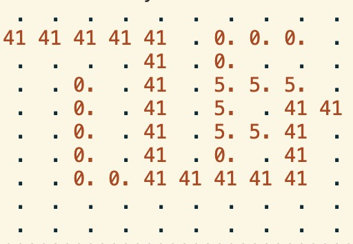

# Ant Colony Optimization for Maze Solving

Olin College, Advanced Algorithms, Spring 2025

Madie Tong, Lily Jiang

## Project Overview

### Ant Colony Optimization (ACO) Algorithm

ACO is a metaheuristic algorithm inspired by the behavior of ants. It is useful
for finding a lowest cost path through a graph, as well as any other problem
that can be reduced to this type of problem.

This project applies ACO to maze solving, where the goal is to find a path from
a starting point to an exit in a maze.

### Mechanism

When ants look for food, they leave a pheromone trail behind them which other
ants can then follow. A pheromone trail becomes stronger as more ants take a
path more often, and subsequent ants will tend to follow more pheromone-heavy
paths. Over time, shorter paths end up acquiring more pheromones, creating a
feedback loop to narrow in on the best path. Thus, the main strength of this
algorithm is that it uses feedback from previous iterations to converge on a
best path. This mechanism is visualized in the diagram below:

As the algorithm runs, the ants will get closer and closer to finding an optimal
path through the maze. It is important to note that there is a level of
randomness involved in the ant pathing, which means they won't always choose the
path with the most pheromones. Thus, even if the optimal solution (global
optima) has been found in a previous iteration, the best solution per iteration
(local optima) won't necessarily be this global optimal path. However, this
randomization allows for more exploration of the solution space, mitigating the
risk of converging on a suboptimal solution too quickly.

### Project Setup Instructions

#### Libraries Used

This project relies only on two built-in Python libraries: `random` and `copy`.
If you have Python installed, you should be able to run the code.

#### Setup + Run Instructions

1. Clone this repository to your local machine.

2. `main.py` holds the driver code for this project. To run the project, just
   run `python main.py` (or `python3 main.py`, depending on your Python version)
   in your terminal.

3. Adjust any parameters or print statements in `main.py` to customize the
   algorithm and output. The parameters and their effects are discussed in the
   section below titled "Parameters and Their Effects".

## Technical Exploration

### ACO Algorithm Steps

1. Initialize ant population.

2. While the termination condition hasn't been met:  
   a. Each ant in the population starts at the start of the maze and begins to
   travel down a path.

   b. At each point in the maze where the path splits into multiple directions,
   the ant chooses a direction to follow according to pheromone levels and a
   specified heuristic. Our specific algorithm uses a simple roulette wheel to
   decide on the direction, where the weights are based on the pheromone levels.

   c. If the ant reaches a dead end or a specified maximum number of steps, the
   ant will terminate (die from hunger).

   d. If the ant reaches the end of the maze, pheromones are deposited on the
   path it took. (Note: this is an abstraction of the real-world process, where
   ants deposit pheromones as they move along the path, rather than the
   pheromones appearing all at once at the end of a successful path.)

   e. For each ant that made it to the exit of the maze, their paths are
   compared to the overall best path. The best path is updated as needed.

   f. Pheromones are evaporated from the paths according to a specified
   evaporation rate, simulating the natural decay of pheromone trails.

3. Return the best path found.

### Parameters and Their Effects

As with all heuristic algorithms, Ant Colony Optimization has parameters that
affect the performance of the algorithm. These parameters can be tuned to
optimize the algorithm for a specific problem, or to improve its performance in
general.

The following parameters are the most important ones to consider when tuning our
ACO algorithm for maze solving:

**Number of ants:**

- Determines how many ants are used to explore the maze for each iteration.
- If the number of ants is too low, the algorithm may not explore enough of the
  maze to eventually find a path due to pheromones evaporating quickly between
  iterations.
- If the number of ants is too high, the algorithm may become overwhelmed with
  pheromones, potentially causing it to converge on a suboptimal path.

**Number of iterations:**

- Determines how long the algorithm runs before terminating.
- If the algorithm doesn't have enough iterations, it may not be able to find a
  path at all, much less converge on a good path.
- If the algorithm is run for too many iterations, it will be a waste of time
  and resources.

**Evaporation rate:**

- Determines how quickly pheromones evaporate from the paths.
- If the evaporation rate is too high, pheromones may evaporate too quickly,
  causing the algorithm to lose track of the best path.
- If the evaporation rate is too low, pheromones may build up too quickly,
  causing the algorithm to be overwhelmed by pheromones and potentially converge
  on a suboptimal path.

**Pheromone strength:**

- Determines how strong pheromones are when they are deposited on the path.
- If the pheromone strength is too low, the pheromones may evaporate too quickly
  and it may become difficult to converge on any path at all.
- If the pheromone strength is too high, the algorithm may converge very quickly
  on a suboptimal solution as the discrepancy will increase between unexplored
  paths and the pheromone-heavy paths.

**Max steps:**

- Determines how many steps an ant can take before it "dies from hunger", or
  terminates.
- If the max steps is too small, the ants may not be able to even reach the end
  of the maze.
- If the max steps is too large, the ants may take too long to reach the end of
  the maze.

There were also a couple parameters for the maze generation that were important
to consider when tuning the ACO algorithm:

**Maze size:**

- A larger maze will generally require more iterations to find a path, while a
  smaller maze will generally converge more quickly.
- A larger maze will also generally require more ants per iteration, while a
  smaller maze requires fewer ants.
- Note: through manual testing, the max size for our maze generation code is
  about 50x50. Any larger, and the recursion depth became too much for a 2020
  Macbook Air to handle.

**Number of exits:**

- The number of exits includes the entrance as the first exit in the `exits`
  list. By default, the maze generation creates two exits (one entrance, one
  exit).
- A maze with multiple exits may require less iterations to find a valid path,
  as there is a higher likelihood of an ant's path leading to an exit.
- A maze with a single exit may converge more quickly, as the ants will have
  fewer paths to explore.

**Maze complexity**

- The amount of intersecting paths in the maze. This is a decimal from 0-1
  specifying the probability that each "dead end" will turn into a path to
  connect with another existing path.
- A higher complexity will result in more intersecting paths, which may make it
  easier for the ants to find a path to the exit as there are more valid paths.
  With even higher complexity, there might be multiple equally valid "best
  paths" (of the same length) to converge upon.
- A lower complexity will result in less valid paths to optimize between. A
  complexity of 0 is equivalent to no intersecting paths, meaning there is only
  exactly one valid path from start to end.

It's important to note that all of these parameters are interconnected, and
tuning one will affect the others. For example, if the number of ants per
iteration is increased, the evaporation rate may need to be increased to prevent
the pheromones from overwhelming the algorithm. Algorithms like ACO require a
lot of experimentation and parameter tuning to achieve a well-performing
algorithm.

## Results

The following visualizations show the output of the ACO algorithm on a
randomly-generated maze.

The initial maze is generated with "0" representing valid path cells:

The maze is solved with the ACO algorithm, and the best path found after all
iterations is highlighted in red:

The pheromone layer is visualized, with higher numbers representing more
pheromones on the cell:

## Applications of ACO in other contexts

ACO is generally good for tackling non-linear, complex problems that are
difficult to solve using traditional optimization methods. Thus, ACO is commonly
used as an approach to a variety of NP-hard problems, as long as the problem can
be reduced to a graph.

Our application of maze solving can very easily be represented as a graph, where
each cell in the maze is a node and the edges are the paths between the cells.
This makes ACO quite effective for maze solving.

### Traveling Salesman Problem

With the Traveling Salesman Problem, the goal is to find the shortest path that
visits a set of cities exactly once and returns to the starting city [1]. This
problem can easily be reduced to a graph, where the cities are the nodes and the
edges are the paths between the cities. Because the TSP is a well-known NP-hard
problem that can easily be represented as a graph, ACO is a great method to use
for solving it [2].

### Protein Folding

Another application of ACO is protein folding, which is a known NP-hard problem
within biology. In this case, the problem is to predict a protein's folded
structure based on its amino acid sequence [3]. What makes ACO effective for
this application is that it has been successfully applied to other combinatorial
problems [7]. The working implementation relies on multiple initial folding
points to converge to a set of potential low-energy configurations, which is
precisely how ACO works with deploying multiple ants per iteration.

### Reservoir Optimization

The problem of reservoir optimization is to determine the optimal storage and
release times of water from a reservoir as it actively gains and loses water
from inflow and demand. Because this is such a complex problem that involves
many constraints and dynamic parts, ACO is a good method to solve it. However,
as the article "Applications of Ant Colony Optimization" states, one of the main
issues with ACO that is highlighted by the reservoir optimization problem is its
large runtime [4]. Various adaptations of the conventional ACO algorithm (such
as the max–min ant system) have been explored to curb this issue.

## Comparison to Other Maze-Solving Algorithms

### ACO vs. Dijkstra's (Greedy) Algorithm

Dijkstra's algorithm is a greedy algorithm that guarantees finding the shortest
path from a starting node to all other nodes in a graph. It does this by
maintaining a priority queue of nodes to explore, and at each step, it selects
the node with the lowest cost to explore next [5].

Dijkstra's algorithm:

- Simple to understand and implement
- Works well on simple, straightforward graphs
- Extremely space-inefficient, as it finds and stores the shortest paths from
  the starting node to _every_ node in the graph

ACO:

- Can handle complex sets of objectives and constraints
- Great for handling large and complex solution spaces
- Requires a lot of experimental parameter tuning, which is time-consuming and
  difficult to get right
- Can be computationally expensive and slow to converge

### ACO vs. Genetic Algorithm

When solving a maze with a genetic algorithm, a solution is represented as a
list of movements (up, down, left, right). The population starts off with a
random set of randomly-generated solutions. With each iteration, the algorithm
evaluates the fitness of each solution, which depends on whether the path
reaches the exit, and if so, the length of the path taken to reach the exit. The
algorithm then selects the best solutions to create offspring via crossover [6].

There are a few similarities between ACO and GA:

- Both algorithms are bio-inspired
- Both algorithms rely on a population of solutions and multiple iterations
- Each subsequent iteration is based on the results of the previous iteration
- Both algorithms include elements of randomness to explore the solution space

Some of the differences are:

- ACO uses pheromones to guide the search process, while GA uses a fitness
  function to evaluate the quality of solutions.
- ACO is more straightforward than GA is, as it doesn't require complex
  operations like crossover and mutation.

## Future Improvements

The current state of our ACO algorithm involves a few abstractions and
limitations which could be improved upon in the future.

### Termination Condition

One example is the termination condition. Currently, we only terminate after a
manually specified amount of iterations, which is quite a simple condition.
However, given the nature of the algorithm, it makes sense to have a termination
heuristic that takes into account the converging aspect of the algorithm.

A potential condition to implement is explored in the paper _"Ant Colony
Optimization: An Advanced Approach to the Traveling Salesman Problem"_ by
Bronwen May, Elizabeth Greer, Griffin Holt, and Kenneth Vargas. They terminate
the algorithm "after the cost of the minimum tour found by the ant colony in a
single iteration has been within Y% of the cost of the best-solution-so-far, X
times in a row" [2]. This ensures that the algorithm approaches an asymptotic
limit, and it terminates relatively quickly once that limit is hit.

### More Complex Exploration Conditions

Given more time, we would also like to implement more conditions and constraints
to the maze to better simulate how ants behave in real life. For example, we'd
want to introduce multiple exits with associated rewards, such that ants must
not only choose a shortest path, but also take into consideration the amount of
"food" they can find at each exit.

Implementing this would require improving the maze generation infrastructure,
and refactoring the heuristics to incorporate the reward system.

## Sources

1. Induraj. “Implementing Ant Colony Optimization in Python- Solving Traveling
   Salesman Problem.” Medium, Medium, 23 Feb. 2023,
   https://induraj2020.medium.com/implementation-of-ant-colony-optimization-using-python-solve-traveling-salesman-problem-9c14d3114475.
2. May, Bronwen, et al. "Ant Colony Optimization: An Advanced Approach to the
   Traveling Salesman Problem." Stanford University,
   https://www.google.com/url?sa=t&source=web&rct=j&opi=89978449&url=https://cap.stanford.edu/profiles/cwmd%3Ffid%3D301672%26cwmId%3D10839%23:~:text%3DThe%2520Ant%2520Colony%2520Optimization%2520Algorithm,cost%2520path%2520through%2520a%2520graph.&ved=2ahUKEwj4iM-exfiMAxXuvokEHX2JFeAQFnoECBcQAw&usg=AOvVaw13UjzGvWwFw_3UKssVfxaX.
3. Stutzle, Thomas, Manuel Lopez-Ibanez, and Marco Dorigo. “A Concise Overview
   of Applications of Ant Colony Optimization.” IRIDIA, CoDE, Universite Libre
   de Bruxelles (ULB), Brussels, Belgium,
   https://lopez-ibanez.eu/doc/StuLopDor2011eorms.pdf.
4. Bhavya, Ravinder, and Lakshmanan Elango. “Ant-Inspired Metaheuristic
   Algorithms for Combinatorial Optimization Problems in Water Resources
   Management.” Department of Geology, Anna University, Chennai 600025, India,
   27 April 2023, https://doi.org/10.3390/w15091712.
5. "Dijkstra's algorithm." https://en.wikipedia.org/wiki/Dijkstra%27s_algorithm.
6. Talha, Muhammad. Maze Solver (Genetic Algorithm).” Medium, Medium, 2 Apr.
   2023,
   https://medium.com/@muhammadtalha1735164/maze-solver-genetic-algorithm-2bfca68897.
7. Shmygelska, Alena, and Holger H Hoos. "An ant colony optimisation algorithm
   for the 2D and 3D hydrophobic polar protein folding problem." BMC
   Bioinformatics, https://pmc.ncbi.nlm.nih.gov/articles/PMC555464/.

<!--
Things to add:
- 2 diagrams in the for "solving YOUR problem"
- describe what the results mean (analysis), like with performance metrics and graphs
  - run like 10 times, see how many work
  - runtime metrics (bc ACO is computationally expensive)
- write more in depth about the two other applications of ACO
- analysis of comparison with other heuristics? basically add some heuristic examples (A* and uhhh)
- make graphs to show results
- test changing the heuristic
-->
